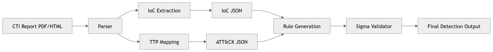

# LLM-driven CTI-to-Detection Pipeline

This repository contains the Module A implementation for an LLM-driven CTI-to-Detection pipeline. It converts CTI PDF reports into structured IoC JSON, optionally enriches the output with PDF layout/parser JSON, and prepares LLM-ready CTI data for downstream detection rule generation.

## Overview

The project focuses on the first stage of the team pipeline:



```text
CTI Report PDF/HTML
      ↓
Parser
      ├── IoC Extraction  ->  IoC JSON
      └── TTP Mapping     ->  ATT&CK JSON

IoC JSON + ATT&CK JSON
      ↓
Rule Generation
      ↓
Sigma Validator
      ↓
Final Detection Output
```

Module A is responsible for extracting Indicators of Compromise (IoCs), normalizing defanged indicators, reducing false positives, and producing stable IoC JSON for downstream modules.

## Repository Structure

```text
1151_LLM-Cyber/
├── IOC/
│   └── IOC_parser.py
│
├── JSON_handle/
│   └── merge.py
│
├── evaluation/
│   ├── export_annotations.py
│   ├── evaluate_annotations.py
│   └── evaluate_ioc_output.py
│
├── docs/
│   └── WEEK15_ANNOTATION_GUIDE.md
│
└── README.md
```

Notes:

- `IOC/IOC_parser.py` is the improved Week 15 IoC extractor.
- `JSON_handle/merge.py` merges IoC JSON with PDF parser/layout JSON.
- `evaluation/` contains the annotation and metric scripts used in Week 15.
- `docs/WEEK15_ANNOTATION_GUIDE.md` explains the manual IoC review workflow in Chinese.

## Dependencies

Python packages used by the IoC extractor:

```bash
python3 -m pip install pypdf tldextract urlextract
```

Main dependencies:

| Package | Purpose |
| --- | --- |
| `pypdf` | Extract text from PDF reports |
| `tldextract` | Normalize and validate registered domains |
| `urlextract` | URL extraction experiments and compatibility |

## Step 1: IoC Extraction

The improved IoC extractor is located at:

```text
IOC/IOC_parser.py
```

It extracts:

- IPv4 addresses
- Domains
- URLs
- MD5 hashes
- SHA1 hashes
- SHA256 hashes
- CVE identifiers

It also includes Week 15 improvements:

- Defanged IoC normalization
- Adjacent/PDF-merged IPv4 matching, such as `80.85.157[.]3N/A`
- URL splitting when multiple URLs are merged by PDF text extraction
- Redacted and placeholder URL filtering
- Benign/vendor/contact domain filtering
- File-like domain artifact filtering, such as `s.zip` and `internal.properties`
- Placeholder IP filtering, such as `2.2.2.2`

### Usage

```bash
python3 IOC/IOC_parser.py \
  --pdf-dir /path/to/pdf_reports \
  --metadata /path/to/download_log.csv \
  --out-dir /path/to/ioc_json_output
```

The metadata CSV is optional. If provided, it should include fields such as report title, source, year, link, and saved filename.

### IoC JSON Output

Each PDF produces one `.iocs.json` file. A combined output is also generated as `all_reports_iocs.json`.

The extractor now uses the same enriched-compatible schema as the final merge output. This keeps the raw extractor output compatible with the teammate enrichment layer while preserving extractor metadata such as source, year, page count, and extraction errors.

Example raw extractor structure:

```json
{
  "schema_version": "cti-enriched-lite-v1",
  "report_id": "example_report",
  "report_title": "Example CTI Report",
  "source_type": "pdf",
  "source": "CISA",
  "year": "2023",
  "original_link": "https://example.com/report.pdf",
  "pdf_file": "/path/to/report.pdf",
  "page_count": 12,
  "text_length": 25000,
  "extraction_errors": [],
  "sections": [],
  "iocs": [
    {
      "type": "domain",
      "value": "matclick.com",
      "normalized_value": "matclick.com",
      "section": "unknown",
      "context": "GraphicalProton HTTPS C2 URL: https://matclick.com/wp-query.php",
      "confidence": 0.6,
      "source": ["regex", "tldextract"],
      "evidence": [
        {
          "source": "regex_ioc_extractor",
          "section_title": "unknown",
          "content": "GraphicalProton HTTPS C2 URL: https://matclick.com/wp-query.php"
        }
      ]
    }
  ],
  "ioc_summary": {
    "domain": 1
  },
  "threat_context": {},
  "merge_notes": {
    "base_json": "ioc_extractor_json",
    "enrichment_json": null,
    "dedup_key": ["type", "normalized_value"]
  }
}
```

## Step 2: PDF Structure Parsing

This repository does not include the full `opendataloader-pdf` package due to dependency and file-size considerations.

If PDF layout or section structure is required, install or set up:

```text
https://github.com/opendataloader-project/opendataloader-pdf
```

The parser output can then be merged with IoC JSON in Step 3.

## Step 3: JSON Enrichment / Merge

The merge script is located at:

```text
JSON_handle/merge.py
```

It merges:

1. IoC extractor JSON
2. PDF parser/layout JSON

The IoC extractor JSON is treated as the base data source. The PDF parser JSON is used as an enrichment source.

The merge process adds or updates:

- Reconstructed sections
- Evidence text
- Source information
- Confidence adjustment
- IP and port relationship
- Basic threat context
- Existing extractor metadata, including report source, year, original link, page count, text length, and extraction errors

### Merge Usage

```bash
python3 JSON_handle/merge.py \
  --ioc-dir /path/to/ioc_json_output \
  --parser-dir /path/to/parser_json_output \
  --out-dir /path/to/merged_output
```

Files are matched by filename stem.

Example:

```text
ioc_json/report_001.iocs.json
parser_json/report_001.json
        ↓
merged/report_001.iocs.json
```

The merged output format:

```json
{
  "schema_version": "cti-enriched-lite-v1",
  "report_id": "...",
  "report_title": "...",
  "source_type": "pdf",
  "source": "...",
  "year": "...",
  "original_link": "...",
  "pdf_file": "...",
  "page_count": 12,
  "text_length": 25000,
  "extraction_errors": [],
  "sections": [],
  "iocs": [],
  "ioc_summary": {},
  "threat_context": {},
  "merge_notes": {}
}
```

## Week 15 Evaluation Workflow

The Week 15 evaluation tools are in:

```text
evaluation/
```

### 1. Export Annotation CSV

```bash
python3 evaluation/export_annotations.py \
  --combined-json /path/to/all_reports_iocs.json \
  --out-dir /path/to/week15_evaluation
```

This creates:

```text
candidate_annotations.csv
missed_iocs.csv
subset_manifest.json
```

### 2. Manually Review Candidates

Open `candidate_annotations.csv` and fill the `label` column with:

```text
malicious
benign
placeholder
false_positive
uncertain
```

If the PDF contains real IoCs missed by the extractor, add them to `missed_iocs.csv`.

See:

```text
docs/WEEK15_ANNOTATION_GUIDE.md
```

### 3. Build Ground Truth and Evaluate Annotations

```bash
python3 evaluation/evaluate_annotations.py \
  --annotations /path/to/week15_evaluation/candidate_annotations.csv \
  --missed-iocs /path/to/week15_evaluation/missed_iocs.csv \
  --out-dir /path/to/week15_evaluation/results
```

This produces:

```text
ground_truth.json
evaluation_metrics.json
```

### 4. Compare IoC Output Against Ground Truth

```bash
python3 evaluation/evaluate_ioc_output.py \
  --output-dir /path/to/ioc_json_output \
  --ground-truth /path/to/week15_evaluation/results/ground_truth.json \
  --out /path/to/output_metrics.json
```

## Week 15 Evaluation Results

The reviewed evaluation subset used 5 CTI reports and 89 baseline IoC candidates.

### Baseline Result

| Metric | Result |
| --- | ---: |
| True Positive | 52 |
| False Positive | 37 |
| False Negative | 3 |
| Precision | 0.5843 |
| Recall | 0.9455 |
| F1-score | 0.7223 |

### Improved Baseline Result

| Metric | Result |
| --- | ---: |
| True Positive | 55 |
| False Positive | 0 |
| False Negative | 0 |
| Precision | 1.0000 |
| Recall | 1.0000 |
| F1-score | 1.0000 |

Important interpretation:

The improved extractor achieved perfect metrics only on the manually reviewed 5-report evaluation subset. This does not prove perfect performance on all 43 reports or unseen CTI reports. It does show that the Week 15 error patterns were successfully identified and fixed.

### Full 43-report Candidate Count

| Version | Total Candidates | Domain | IPv4 | URL | MD5 | SHA1 | SHA256 | CVE |
| --- | ---: | ---: | ---: | ---: | ---: | ---: | ---: | ---: |
| Baseline | 1608 | 688 | 95 | 238 | 259 | 30 | 254 | 44 |
| Improved baseline | 1455 | 611 | 116 | 141 | 259 | 30 | 254 | 44 |

URL and domain candidates decreased after filtering. IPv4 candidates increased because the improved regex recovered defanged or PDF-adjacent IP addresses that were previously missed.

## Integration Notes

The recommended Week 16 integrated flow is:

```text
CTI PDF
      ↓
IOC/IOC_parser.py
      ↓
IoC JSON
      ↓
opendataloader-pdf parser JSON
      ↓
JSON_handle/merge.py
      ↓
LLM-ready enriched CTI JSON
      ↓
Rule Generation
```

The current extractor is deterministic. LLM refinement can be added as a second-stage validation layer using the `context` field in each IoC entry.

Suggested LLM labels:

```text
malicious
benign
placeholder
false_positive
uncertain
```

## Limitations

- The reviewed ground truth currently covers only 5 reports.
- PDF text extraction can still merge or split table content incorrectly.
- The `section` field remains `unknown` unless parser JSON is merged.
- Filtering rules may need updates for new CTI report formats.
- LLM refinement is designed but not yet fully integrated into the execution pipeline.

## Recommended Next Steps

- Run `IOC/IOC_parser.py` on selected Week 16 demo reports.
- Generate parser/layout JSON using `opendataloader-pdf`.
- Merge IoC JSON and parser JSON with `JSON_handle/merge.py`.
- Pass enriched CTI JSON to the detection rule generation module.
- Add optional LLM refinement for candidates with weak or ambiguous context.
